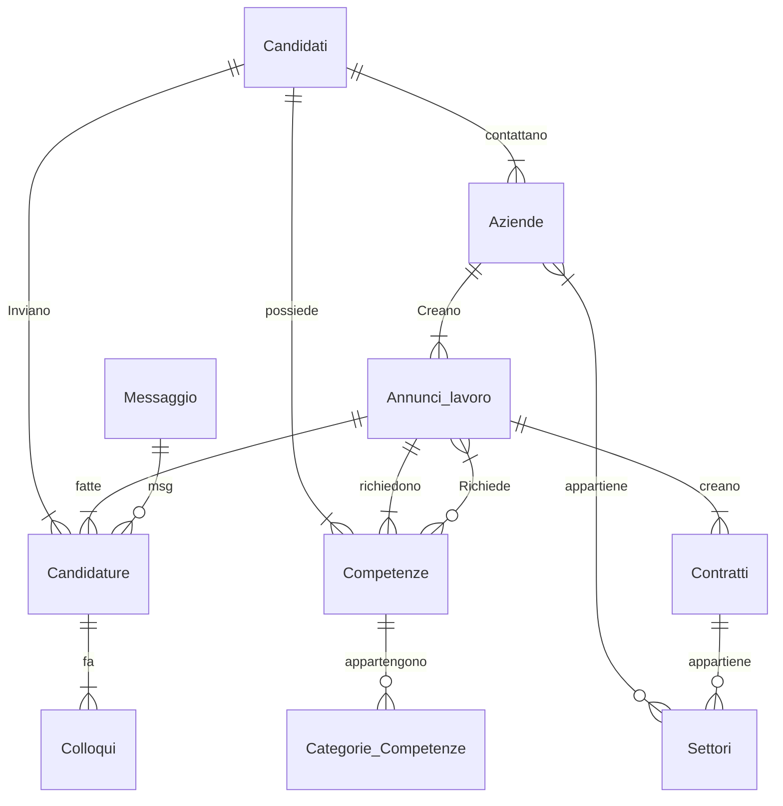

# Relazione Tecnica

## Progetto: Sistema di Recruiting

*Andrea Neyroz*  
**Classe:** *5C IT*  
---
## Indice
1. [Introduzione al progetto](#introduzione-al-progetto)
2. [Analisi dei requisiti](#analisi-dei-requisiti)
3. [Diagramma ER](#diagramma-er)
4. [Schema logico e scelte progettuali](#schema-logico-e-scelte-progettuali)
5. [Vincoli e controllo dei dati](#vincoli-e-controllo-dei-dati)
6. [Dizionario dei dati](#dizionario-dei-dati)
7. [Conclusioni](#conclusioni)

## Introduzione al progetto

In questa relazione verrà descritta la progettazione e l’implementazione di un database per la gestione di un sistema di recruiting.

Il database consente di gestire candidati, aziende, annunci di lavoro, candidature, colloqui e messaggi.

## Analisi dei requisiti

I requisiti principali del sistema sono:

1. Gestire i dati dei candidati e delle aziende
2. Permettere a un candidato di candidarsi a più annunci di lavoro
3. Associare ogni annuncio a una specifica azienda
4. Tracciare lo stato di ogni candidatura (inviata, in revisione, colloquio, accettata)
5. Gestire i colloqui e lo scambio di messaggi tra candidato e azienda

---

## Diagramma ER

La progettazione concettuale è la seguente:

## Schema logico e scelte progettuali

Lo schema logico è stato ottenuto traducendo il diagramma ER in tabelle relazionali.

Le principali scelte progettuali sono:

* Utilizzo di **chiavi primarie** per identificare univocamente ogni record
* Uso di **chiavi esterne** per rappresentare le relazioni tra le entità
* Introduzione della tabella **Candidature** per gestire la relazione molti a molti
* Utilizzo di un attributo **statp** di tipo **VARCHAR** con vincolo **CHECK** per limitare i valori ammessi

Queste scelte permettono una maggiore flessibilità e garantiscono la coerenza dei dati.

## Vincoli e controllo dei dati

Nel database sono stati applicati diversi vincoli per garantire la correttezza e la coerenza dei dati.

### Chiavi primarie
Ogni tabella è dotata di una **chiave primaria (PRIMARY KEY)**, utilizzata per identificare in modo univoco ogni record.  

L’utilizzo delle chiavi primarie evita la duplicazione dei dati e garantisce l’univocità.

### Chiavi esterne
Per rappresentare le relazioni tra le tabelle sono state utilizzate **chiavi esterne (FOREIGN KEY)**.  
Questi vincoli assicurano l’integrità referenziale tra le entità del database.

Alcuni esempi sono:
- **codF** nella tabella **Candidature**, che fa riferimento a **Candidati(codF)**
- **codA** nella tabella **Annunci_lavoro**, che fa riferimento a **Aziende(codA)**

In alcuni casi è stato usato il vincolo **ON DELETE CASCADE**, che da la possibilità di eliminare automaticamente i record correlati quando viene eliminato il record principale.

### Vincoli di dominio
Per limitare i valori ammessi in alcuni campi, sono stati utilizzati **vincoli di dominio**.

In particolare, nella tabella **Candidature** lo stato della candidatura è gestito tramite un attributo **ENUM**, che consente solo valori predefiniti:

stato ENUM ('inviati','in_revisione','colloquio','accettata')

### Vincoli d'integrità
Sono stati definiti diversi vincoli di integrità con l’obiettivo di garantire la coerenza e la correttezza dei dati memorizzati.

Un esempio:

**gFerie INT CHECK (gFerie >= 0)**

Con il check vado a controllare che le giornate di ferie siano uguali o maggiori di 0.

## Dizionario dei dati

### Tabella Candidati

| Campo      | Tipo         | Descrizione                       |
|------------| -------------|-----------------------------------|
| codF       | VARCHAR(16)  | Codice fiscale del candidato (PK) |
| link_CV    | VARCHAR(200) | Link al curriculum                |
| esperienze | TEXT         | Esperienze lavorative             |

### Tabella Candidature

| Campo           | Tipo        | Descrizione                     |
|-----------------|-------------|---------------------------------|
| codCand         | INT         | Identificativo candidatura (PK) |
| codF            | VARCHAR(16) | Candidato                       |
| codAnl          | VARCHAR(16) | Annuncio di lavoro              |
| dataCandidatura | DATE        | Data candidatura                |
| stato           | VARCHAR(20) | Stato della candidatura         |

### Tabella Annunci_lavoro

| Campo       | Tipo    | Descrizione          |
|-------------|---------|----------------------|
| codAnl      | VARCHAR | Codice annuncio (PK) |
| Ral         | VARCHAR | Retribuzione annua   |
| requisiti   | TEXT    | Requisiti richiesti  |
| descrizione | TEXT    | Descrizione annuncio |

### Tabella Competenze

| Campo       | Tipo    | Descrizione            |
|-------------|---------|------------------------|
| codCr       | INT     | Codice Competenza (PK) |
| nome        | VARCHAR | nome competenza        |

### Tabella Categoria compotenze 

| Campo       | Tipo    | Descrizione                      |
|-------------|---------|----------------------------------|
| codCr       | INT     | Codice categoria Competenza (PK) |
| nomeCat     | VARCHAR | nome categoria                   |

### Tabella Aziende

| Campo           | Tipo          | Descrizione          |
|-----------------|---------------|----------------------|
| codA            | INT           | Codice azienda  (PK) |
| ragioneSociale  | VARCHAR (150) | ragione sociale      |
| ind_via         | VARCHAR (100) | Requisiti richiesti  |
| ind_civ         | INT           | indirizzo civico     |
| ind_citta       | VARCHAR (100) | citta                |
| email           | varchar (150) | email                |

### Tabella Settori

| Campo       | Tipo         | Descrizione         |
|-------------|--------------|---------------------|
| codSett     | INT          | Codice settore (PK) |
| nomeSettore | VARCHAR(100) | nome settore        |

### Tabella Contratti

| Campo            | Tipo          | Descrizione          |
|------------------|---------------|----------------------|
| codC             | INT           | Codice contratto(PK) |
| gFerie           | INT           | giorni ferie         |
| nOre_settimanali | INT           | ore settimanali      |
| nomeContratto    | VARCHAR(100)  | nome contratto       |

### Tabella Colloqui

| Campo            | Tipo          | Descrizione          |
|------------------|---------------|----------------------|
| codQ             | INT           | Codice colloquio(PK) |
| esito            | BOOL          | esito colloquio      |

### Tabella Messaggio

| Campo            | Tipo          | Descrizione                      |
|------------------|---------------|----------------------------------|
| codM             | INT           | Codice messaggio(PK)             |
| contenuto        | TEXT          | contenuto                        |
| dataOra_invio    | TIMESTAMP     | ora invio                        |
| utente           | BOOL          | True= messaggio dall'utente      |
|                  |               | False= messaggio dall'azienda    |

## Conclusioni
Il database mostrato consente di gestire in modo strutturato un sistema di recruiting, garantendo l’integrità dei dati grazie all’uso di chiavi primarie e l'utilizzo di alcuni vincoli. 

La struttura del database risulta chiara, coerente ed estendibile, ad esempio aggiungendo nuovi campi, nuove entità o ulteriori stati di candidatura, senza modificare l’impianto generale del sistema.

